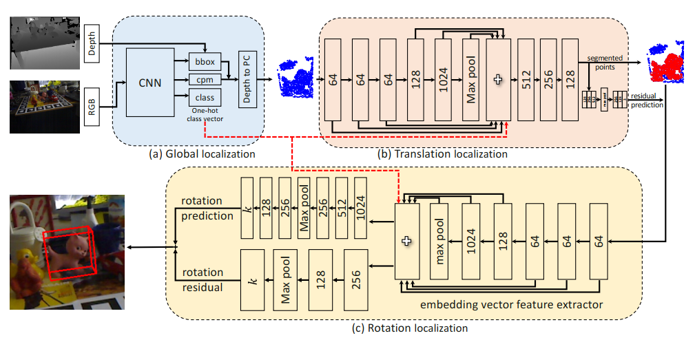

# CVPR2020最新热点：物体位姿估计

**作者 |文永明**

**学校 | 中山大学**

**研究方向 | 物体位姿估计、目标检测**

## 目录

- **G2L-Net**:从全局到局部的6D位姿估计网络
- **PVN3D**:3D关键点投票6D姿态估计网络
- 基于**可微分代理投票损失**的6D姿态估计

## G2L-Net:从全局到局部的6D位姿估计网络

​	第一篇推荐的CVPR2020论文来自伯明翰大学和国防科技大学，提出了一种新的实时6D目标姿态估计框架G2L-Net，该网络在RGB-D探测的点云上以分治的方式运行，能节省时间，并且能达到SOTA的效果。这篇论文很好的是已经把代码开源放了出来，github地址是：https://github.com/DC1991/G2L_Net

​	该位姿估计模型框架流程可以分为以下三步：

1. 第一步先从目标物体的RGB-D图像获得粗糙的点云。
2. 第二步把目标物体的点云传进平移定位网络，进一步进行3D语义分割和估计目标物体的平移。
3. 第三步把经过语义分割和平移后得到精细的点云转换到局部标准坐标系，用旋转定位网络来训练队点向嵌入特征估计物体的旋转。

Fig 1: G2L-Net的框架示意图

​    笔者认为这篇文章特别之处在于两点，他们的**点向嵌入特征充分利用了不同视角的信息**从而提高了精度。之前大部分位姿估计模型包括DenseFusion，它们的refine阶段估计得位姿是异步的，也就是先训练好粗略旋转的网络，进一步再去训练细化这个旋转。而这篇论文另辟蹊径在旋转定位网络中估计的粗略旋转与旋转残差估计网络估计的**旋转残差同步输出**，从而节省了运行时间。

Fig 2: 不同视点（对于一个3D物体，需要至少四个四点来覆盖）

​	充分利用不同视角信息的想法是来自他们发现在不同视角下全局特征是高度相关高度相似的，这限制了泛化性能，在实验部分就可以表明，在相同大小规模的数据集中，使用点向嵌入特征，由于引入的视角信息，能提高泛化能力。

Fig 3: (a)相同数据规模下，G2L-Net与Frustum-P的ADD-(s)指标对比
    	(b)训练轮次的影响

​	其中的旋转定位网络由三个部分组成，如图4所示，先训练A结构的网络来预测指向关键点的单位向量，再用B结构来生成对于物体旋转估计的点向嵌入向量，再用C结构的网络来训练旋转残差。

Fig 4: 旋转定位网络的结构

对于旋转定位网络，论文指出我们可以定义如下的损失函数：
$$
\ell(\boldsymbol{\theta})=\min _{\boldsymbol{\theta}} \frac{1}{K|\mathcal{X}|} \sum_{k=1}^{K} \sum_{i}\left\|\tilde{v}_{k}\left(\mathcal{X}_{i} ; \boldsymbol{\theta}\right)-v_{k}\left(\mathcal{X}_{i}\right)\right\|_{2}^{2}
$$
其中$K$表示关键点的数量，$\theta$表示网络参数，$\widetilde{v}_{k}\left(\mathcal{X}_{i} ; \boldsymbol{\theta}\right)$和$v_{k}\left(\mathcal{X}_{i}\right)$表示预测的向量和目标真实值，$\mathcal{X} \in \mathbb{R}^{n \times 3}$表示物体点云的标准坐标空间，$|\mathcal{X}|$则是点的数目。

​	  最后来看看在LINEMOD数据集上的实验效果：

Fig 5: G2L-Net实验效果

​	  效果看起来真的很好了，**ADD指标达到了98.7**，FPS是23倒是可以接受。笔者准备后续参考github公开的代码实验一番，看看到底是否真的能达到论文所说的这么好的效果来。

## PVN3D:3D关键点投票6D姿态估计网络

​	  这是一项港科大、深大还有旷视研究院合作的工作，将基于2D关键点的方法引入到3D位姿估计中，提出一种基于霍夫投票的3D关键点检测网络，利用了刚体的几何约束，提高了6D姿态估计的精确度。这篇论文代码也已经开源啦，有兴趣的同学可以去看看。github地址是：https://github.com/ethnhe/PVN3D.git

Fig 6: PVN3D总框架

​		以RGBD图像为输入，使用特征提取模块融合外观特征和几何信息。将学习到的特征输入三维关键点检测模块$M_k$ ，$M_k$经过训练可以预测每个点的偏移量。此外，还是用了实例语义分割模块$M_s$预测每个点的语义标签，而中心投票模块$M_c$预测每个点到对象中心的偏移量。通过学习每个点的偏移量，使用聚类算法来区分具有相同语义标签的不同实例和相同实例上的点对目标关键点进行投票。最后，将最小二乘拟合算法应用于预测关键点，估计出6自由度的位姿参数。

​		投票的点由聚类算法进行聚类以消除离群点的干扰，群集的中心点被选为投票选出的关键点，预测每个点偏移量的损失函数：
$$
L_{\text {keypoints }}=\frac{1}{N} \sum_{i=1}^{N} \sum_{j=1}^{M}\left\|o f_{i}^{j}-o f_{i}^{j *}\right\| \mathbb{I}\left(p_{i} \in I\right)
$$
​		给定提取出的逐点特征，语义分割模块$M_s$预测每点的语义标签，论文使用了 Focal loss：
$$
\begin{aligned}
L_{\text {semantic}}=-\alpha\left(1-q_{i}\right)^{\gamma} \log \left(q_{i}\right) \\
\text {where} & q_{i}=c_{i} \cdot l_{i}
\end{aligned}
$$
​		而中心点投票模块$M_c$投票出不同物体的中心点，以区分相同语义的不同实例，论文中使用了L1 损失函数进行监督学习：

$$
L_{\text {center }}=\frac{1}{N} \sum_{i=1}^{N}\left\|\Delta x_{i}-\Delta x_{i}^{*}\right\| \mathbb{I}\left(p_{i} \in I\right)
$$
​		最终的多任务损失函数为：
$$
L_{\text {multi-task }}=\lambda_{1} L_{\text {keypoints }}+\lambda_{2} L_{\text {semantic }}+\lambda_{3} L_{\text {center }}
$$
​		对于关键点的选择训练实现，将最小二乘拟合算法应用于预测关键点：
$$
L_{\text {least-squares }}=\sum_{j=1}^{M}\left\|k p_{j}-\left(R \cdot k p_{j}^{\prime}+t\right)\right\|^{2}
$$
​		同样，我们看一下在LINEMOD数据集上的实验效果，**ADD(S)指标是95.1**：

Fig 7: PVN3D实验效果

​			YCB-Video数据集的定性实验效果图：

Fig 8: PVN3D定性实验（YCB-Video）

​		可以看到是比DenseFusion的效果稍好，DenseFusion右边有个钳子都反了，而PVN3D没有，不过是部分定性实验的效果，未知全貌了。

## 基于可微分代理投票损失的6D目标姿态估计

​		这是一项来自澳大利亚国立大学的工作，可谓是“小题大做”型的论文了，论文考虑的角度是，基于向量场的关键点投票已经证明了它在解决6D位姿估计问题上的有效性和优越性。然而，向量场的直接回归忽略了像素点与关键点之间的距离对假设偏差的影响。换句话说，**当像素远离关键点时，方向向量上的小误差可能会对预估的关键点产生严重偏差**。直观点就是如图9所示：

Fig 9: PVN3D总框架

​		相同的角度，当距离越远时，预估的关键点会和实际的关键点产生更大的距离偏差。为了解决这种忽略了像素点与关键点之间的距离对假设偏差的影响，他们提出了一种可微分的代理投票损失。

Fig 10: DPVL总框架

​		论文作者使用了smooth L1损失来回归真实的方向向量：
$$
\begin{aligned}
\mathcal{L}_{v f} &=\sum_{k \in K} \sum_{p \in \mathcal{M}} \ell_{1}\left(\left\|u_{k}(p)-v_{k}(p)\right\|_{1}\right) \\
\ell_{1}(a) &=0.5 a^{2} \mathbb{1}(|a|<1)+(|a|-0.5) \mathbb{I}(|a| \geq 1)
\end{aligned}
$$
​		其中,$\boldsymbol{v}_{k}(\boldsymbol{p})$表示估计的方向向量，$\mathcal{M}$表示物体的掩码，$\mathbb{I}(\cdot)$表示知识函数，$a$表示标量变量。

​		如前所述，**单位方向向量估计误差较小，也可能会导致假设偏差较大**，假设点不集中会导致关键点不准确，从而降低姿态估计的性能。与以前的工作不同，考虑了假设点的分布，并强制所有的假设点接近于真实关键点。假设一个对象包含$M$个像素，则有$M(M-1)$个假设。虽然对于从两个像素点获得两个方向向量的假设有一个封闭的解，但是计算所有的假设会导致深度网络的训练效率低下，特别是当一个物体的分辨率非常大的时候，由于决定一个关键点到直线上某个点的距离是没有上界的，而是有下界的，所以选择使用通过一个关键点的**垂线的垂足**来近似代理假设点。这样，我们只需要计算$M$个垂线，而不是$M(M-1)$个假设，大大减少了计算量。更重要的是，**一个关键点$k$与垂足$\boldsymbol{f}_{k}(\boldsymbol{p})$与像素$p$的方向向量$\boldsymbol{v}_{k}(\boldsymbol{p})$之间的距离是一个闭合形式的解，也是可微的。**因此，将距离最小化作为**可微分的代理投票损失(DPVL)** ，以迫使代理假设点更接近于关键点：
$$
\begin{aligned}
\mathcal{L}_{p v} &=\sum_{\boldsymbol{k} \in \boldsymbol{K}} \sum_{\boldsymbol{p} \in \mathcal{M}} \ell_{1}\left(\left\|\boldsymbol{k}-\boldsymbol{f}_{k}(\boldsymbol{p})\right\|_{1}\right) \\
&=\sum_{\boldsymbol{k} \in \boldsymbol{K}} \sum_{\boldsymbol{p} \in \mathcal{M}} \ell_{1}\left(\frac{\left|v_{k}^{y} k^{x}-v_{k}^{x} k^{y}+v_{k}^{x} p^{y}-v_{k}^{y} p^{x}\right|}{\sqrt{\left.\left(v_{k}^{x}\right)^{2}+\left(v_{k}^{y}\right)^{2}\right)}}\right)
\end{aligned}
$$
​		其中$\boldsymbol{v}_{k}(\boldsymbol{p})=\left(v_{k}^{x}, v_{k}^{y}\right), \boldsymbol{p}=\left(p^{x}, p^{y}\right), \boldsymbol{k}=\left(k^{x}, k^{y}\right)$，由于$\boldsymbol{v}_{k}(\boldsymbol{p})$是直接从我们的网络中估计出来的，它可能不是单位向量，所以在这里面中有一个归一化操作。

​		在LINEMOD数据集上的实验效果，**ADD(S)指标是91.50**：

​		效果上在这三篇里面是最低的了，但是贵在文章的可微分的公式推理上有可取之处，定性效果如下：

​		对比原来向量场的直接回归的方法PVNet来说，是有所改进的。

## 总结

​		毫无疑问，对于视觉领域来说，越来越多迹象显示未来的研究热点要么在时间维度上，比如视频的处理和理解。另外一个就是在空间维度上做文章，如三维视觉(三维感知、SLAM、三维物体识别与分割、位姿估计)，这里面6自由度的物体位姿估计的论文应该会越来越多，也会越做越好。